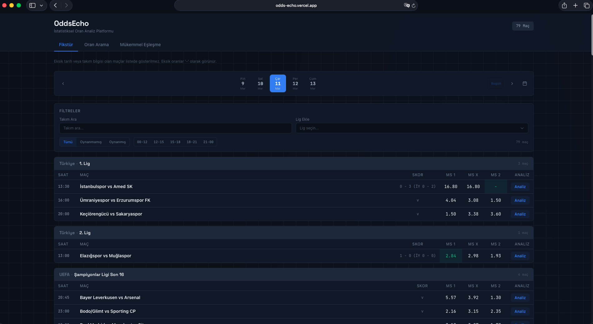
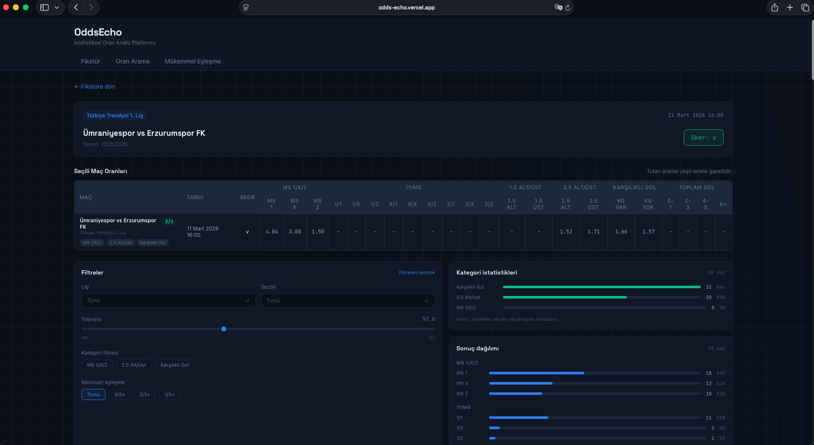
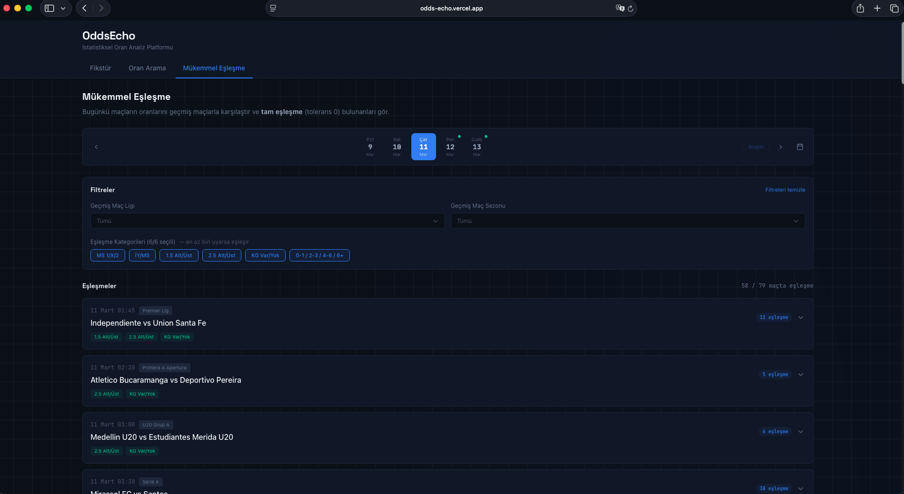

# OddsEcho

A sports analytics platform that collects historical betting odds and analyzes how matches with similar odds have resulted in the past. Built with a Python scraping pipeline, Supabase (PostgreSQL), and a Next.js analytics dashboard.

**[Live Demo &rarr; odds-echo.vercel.app](https://odds-echo.vercel.app)**


<!-- Screenshots - add your own images to docs/screenshots/ -->
<!--  -->
<!--  -->
<!--  -->

---

## What It Does

- **Odds Similarity Analysis** — Find historical matches with similar odds and see how they resulted (win/draw/loss distributions)
- **Perfect Match Detection** — Spot upcoming fixtures where odds exactly match a historical pattern, with Telegram notifications
- **200K+ Match Database** — Continuously scraped archive covering 40+ leagues across multiple seasons
- **Queue-Based Scraping** — Fault-tolerant, chunk-based data collection with automatic retry and status tracking
- **Fixture Monitoring** — LiveData sync for upcoming matches with automatic score tracking

---

## Architecture

```
Data Source (Web)
       |
       v
[Selenium Scraper]  ──>  [Supabase / PostgreSQL]  <──  [Next.js Web UI]
       |                         |
       v                         v
 [match_queue]              [matches]
 PENDING / MONITORING       (single source of truth)
       |
       v
 [Telegram Bot]
```

| Layer | Stack |
|-------|-------|
| Scraping | Python, Selenium, BeautifulSoup |
| Database | Supabase (PostgreSQL) |
| Frontend | Next.js 16, React 19, TypeScript, Tailwind CSS 4, Recharts |
| Notifications | Telegram Bot API (HTML card + screenshot) |

---

## Pages

| Page | Description |
|------|-------------|
| [`/`](https://odds-echo.vercel.app) | Daily fixture list with league grouping, filters, and date navigation |
| `/odds-search` | Search by odds values with tolerance slider, view result distributions |
| `/match/[id]` | Find historically similar matches for any fixture |
| `/analysis/[id]` | Category-based analysis dashboard with statistics |
| `/perfect-match` | Exact odds match detection across all fixture categories |

---

## Project Structure

```
odds-scrape-mackolik/
├── main.py                      # CLI entry point (9 commands)
├── scraper_engine.py            # Single match scraper + upsert
├── batch_processor.py           # Queue worker (PENDING/ERROR/MONITORING)
├── monitoring_worker.py         # Fixture tracking within time windows
├── queue_manager.py             # Queue operations
├── link_harvester.py            # Season/week match link collection
├── livedata_update_fixtures.py  # LiveData fixture sync
├── notify_perfect_matches.py    # Telegram visual notification pipeline
├── repair_queue.py              # matches <-> match_queue state reconciliation
├── config.py                    # Supabase connection & env config
└── web-ui/                      # Next.js 16 + React 19
    ├── app/
    │   ├── page.tsx             # Fixtures
    │   ├── odds-search/         # Odds search
    │   ├── match/[id]/          # Similar matches
    │   ├── analysis/[id]/       # Analysis dashboard
    │   ├── perfect-match/       # Perfect match dashboard
    │   └── api/                 # 6 API routes
    └── components/              # 8 client components
```

---

## How It Works

**Data Collection:**
```
fill-queue → match_queue (PENDING) → run-worker → matches upsert → SUCCESS / ERROR / BAD_DATA
```

**Fixture Monitoring:**
```
update-fixtures → match_queue (MONITORING) → run-monitoring-worker → score arrives → SUCCESS
```

**Perfect Match Notifications:**
```
notify-perfect-matches → compare fixture odds vs history → render HTML card → screenshot → Telegram
```

---

## Database

Single source of truth design — both fixtures and historical results live in the `matches` table.

| Table | Purpose |
|-------|---------|
| `matches` | All match data: teams, scores, 20 odds fields, status |
| `match_queue` | Scraping queue with status tracking (PENDING/MONITORING/SUCCESS/ERROR/BAD_DATA) |
| `leagues` | League reference data |
| `seasons` | Season reference data with external IDs |

---

## License

This project is built for personal use and portfolio purposes.
